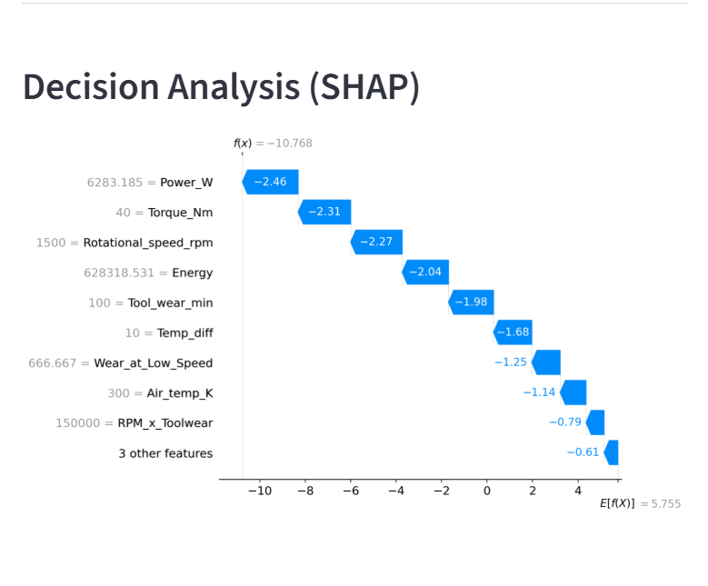
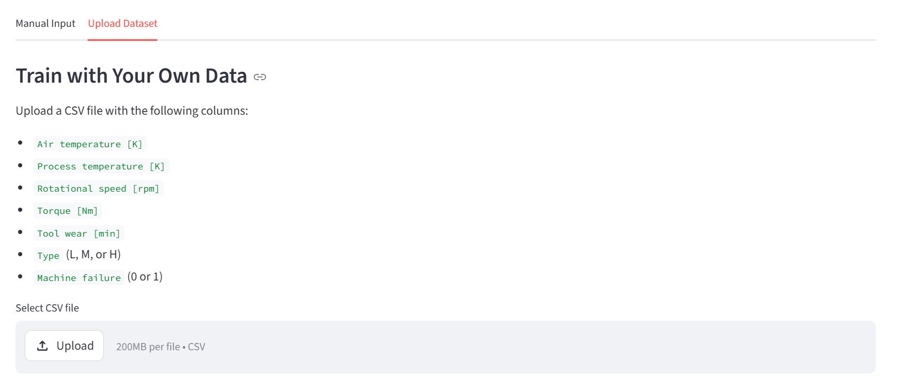

# Predictive Maintenance Dashboard

A machine learning system that predicts industrial equipment failure from sensor data,
with SHAP explainability and an interactive Streamlit dashboard.

## Live Demo
[🚀 Open Dashboard](https://ai4i-predictive-maintenance.streamlit.app/)

## Overview
This project builds an end-to-end predictive maintenance pipeline using the
AI4I 2020 dataset. The goal is to predict machine failure before it occurs,
minimizing unplanned downtime in industrial environments.

The project combines mechanical engineering domain knowledge with machine learning —
engineered features are derived from physical principles (mechanical power, 
heat dissipation, tool wear dynamics) rather than purely statistical approaches.

## Results
| Metric | Value |
|--------|-------|
| F1-Score (Failure) | 0.86 |
| Precision (Failure) | 0.88 |
| Recall (Failure) | 0.84 |
| False Alarms | 8 / 2,000 |
| Missed Failures | 11 / 2,000 |

## Features
- **Failure prediction** from 5 sensor inputs with adjustable decision threshold
- **SHAP explainability** — understand why each prediction was made
- **Cost estimation** — calculate savings from early maintenance
- **Custom dataset upload** — retrain the model on your own data

## Screenshots

### Failure Prediction & Cost Estimation


### SHAP Decision Analysis


### Custom Dataset Upload


## Tech Stack
- **ML:** XGBoost, scikit-learn, Optuna (hyperparameter tuning)
- **Explainability:** SHAP
- **Dashboard:** Streamlit, Plotly
- **Data:** pandas, numpy

## Feature Engineering
New features derived from mechanical engineering principles:

| Feature | Formula | Physical Meaning |
|---------|---------|-----------------|
| Power_W | Torque × (RPM × 2π/60) | Mechanical power output |
| Temp_diff | Process temp − Air temp | Heat dissipation capacity |
| Energy | Power × Tool wear | Cumulative energy input |
| Torque_x_Toolwear | Torque × Tool wear | Mechanical stress indicator |
| Wear_at_Low_Speed | Tool wear × (10000/RPM) | Wear weighted by low speed |

## Failure Type Analysis
The dataset contains 5 distinct failure modes:

| Failure Type | Incidents | Main Cause |
|-------------|-----------|------------|
| HDF (Heat Dissipation) | 115 | High torque + low RPM + high temperature |
| OSF (Overstrain) | 98 | High torque + high tool wear |
| PWF (Power) | 95 | Extreme power values |
| TWF (Tool Wear) | 46 | Excessive tool wear |
| RNF (Random) | 19 | No specific cause |

## Limitations
- The AI4I 2020 dataset is synthetically generated. Failure thresholds are 
  built into the data by design, which causes sharp decision boundaries 
  that may not generalize to real-world sensor data.
- The optimal threshold (0.35) assumes a specific cost ratio between false alarms 
  and missed failures. In production, this should be adjusted based on actual 
  maintenance and downtime costs.

## Project Structure
```
ai4i-predictive-maintenance/
├── data/                               # Dataset
├── models/                             # Saved model files
│   ├── xgb_model.pkl
│   ├── feature_names.pkl
│   ├── label_encoder.pkl
│   └── threshold.pkl
├── predictive_maintenance_final.ipynb  # Final clean notebook
├── working_notebook.ipynb              # Full working notebook with experiments
├── app.py                              # Streamlit dashboard
├── requirements.txt                    # Dependencies
└── README.md
```

## Installation
```bash
git clone https://github.com/username/ai4i-predictive-maintenance
cd ai4i-predictive-maintenance
pip install -r requirements.txt
streamlit run app.py
```

## Dataset
[AI4I 2020 Predictive Maintenance Dataset](https://archive.ics.uci.edu/dataset/601/ai4i+2020+predictive+maintenance+dataset)
— UCI Machine Learning Repository